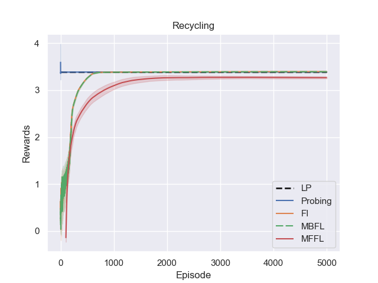
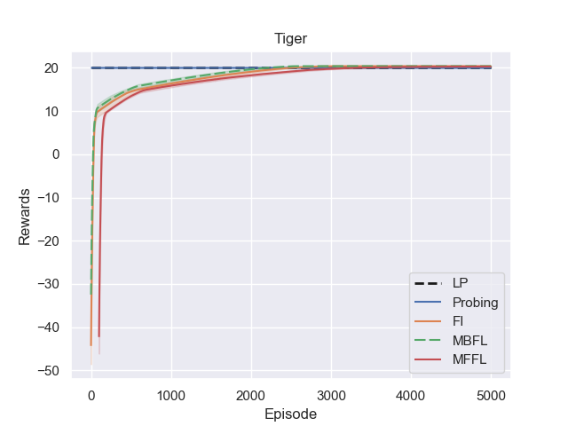
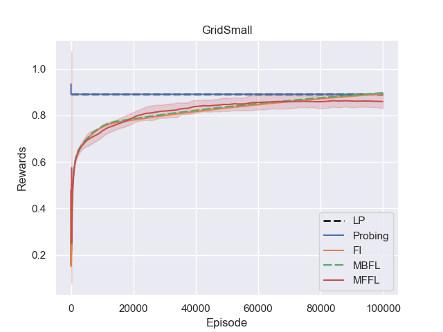
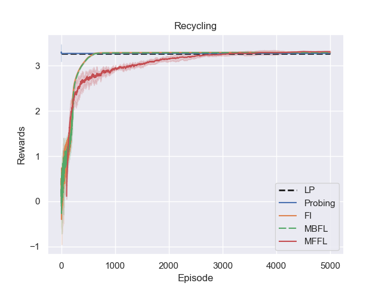
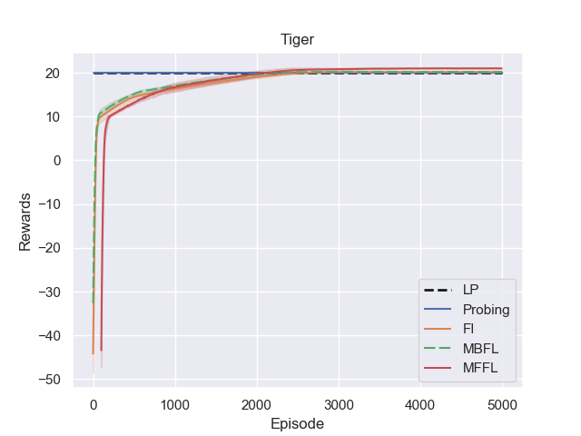

# Constrained Reinforcement Learning as Frequency Learning

This repository contains materials for supporting our submission at ICML 2019. More specifically, the submission is about designing innovative approach for solving **constrained** MDP using **Frequency Learning**. By this term, we mean  learning the **state-action frequency** that minimizes the **discounted cost criterion** or the **average-cost criterion**.

We also conducted some experiments providing preliminary empirical support to the proposed methodology. We build them upon problems from the literature available at http://masplan.org. The commands for generating the plots below can be found in the file [commands.txt](./commands.txt).

## Discounted Cost Criterion

### Recycling

### Tiger

### GridSmall

## Average Cost Criterion

### Recycling

### Tiger

